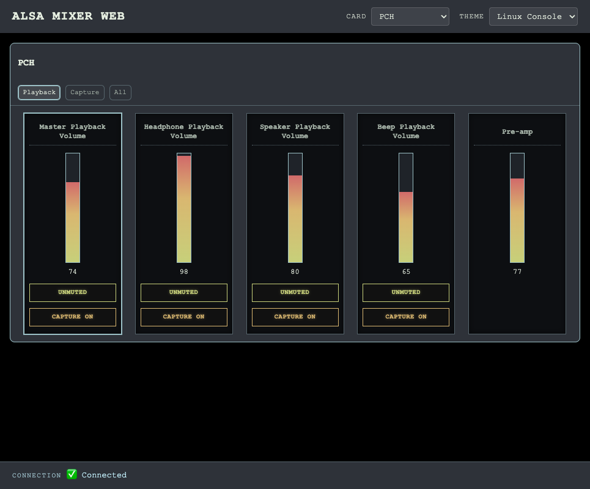

# alsamixer-web

A web-based remake of the venerable `alsamixer` [terminal UI](assets/alsamixer.png) for Linux ALSA sound cards. It just allows you to tune hardware & software audio mixer settings from any browser.



**[View Screenshot Gallery →](SCREENSHOT-GALLERY.md)**

## What is this?

alsamixer-web brings the classic alsamixer experience to the web. It's a Go backend that interfaces with ALSA mixer controls, paired with a lightweight HTMX-powered frontend. Think of it as a remote control for your sound card. I wrote this as a convenience for my homelab use, where a Linux boxen running [shairport-sync](/mikebrady/shairport-sync) drives the sound system.

## Features

- **Multiple themes** — Terminal, Linux Console, Modern, Muji, Creative, Mobile
- **Real-time sync** — Server-Sent Events keep the UI in sync with ALSA state
- **Responsive** — Works on desktop and mobile browsers
- **Playback/Capture views** — Filter controls by type (matching alsamixer behavior)

## Requirements

- Linux with ALSA (`libasound2-dev`)
- Go 1.23+

## Building

```bash
make alsamixer-web        # Build local binary
make build-linux-amd64    # Cross-compile for Linux AMD64
make build-linux-arm64    # Cross-compile for Linux ARM64
```

## Running

```bash
./alsamixer-web
```

By default runs on `0.0.0.0:8080`. Override with `--bind` and `--port`:

```bash
./alsamixer-web --bind 127.0.0.1 --port 9000
```

## Deployment

The included systemd service file (`alsamixer-web.service`) runs alsamixer-web as a user service:

```bash
cp alsamixer-web.service ~/.config/systemd/user/
systemctl --user daemon-reload
systemctl --user enable --now alsamixer-web
```

## Testing

```bash
make test                 # Unit tests
E2E_BASE_URL=http://localhost:8080 node e2e.test.js  # E2E tests
```

E2E tests require [Playwright](https://playwright.dev/) and a browser (configured for Brave on macOS).

## Project Structure

```
alsamixer-web/
├── cmd/alsamixer-web/    # Main entry point
├── internal/
│   ├── alsa/             # ALSA mixer interface
│   ├── config/           # Configuration
│   ├── server/           # HTTP server + handlers
│   └── sse/              # Server-Sent Events hub
├── web/
│   ├── static/           # CSS, JS, themes
│   └── templates/        # HTML templates
├── references/           # alsamixer source for reference
└── e2e*.js              # Playwright tests
```

## Credits

- Built to match [alsamixer](https://github.com/alsa-project/alsa-utils) behavior
- Uses [gen2brain/alsa](https://github.com/gen2brain/alsa) for ALSA bindings
- Frontend powered by [HTMX](https://htmx.org/)

## License

MIT
