# Theme Screenshot Gallery

This gallery showcases the available themes for ALSA Mixer Web in both desktop and mobile views.

## Themes

### Linux Console
The classic TUI look, modernized for the web.

| Desktop | Mobile |
|---------|--------|
|  | 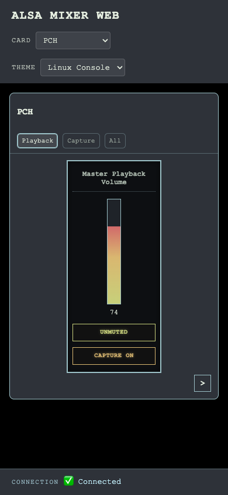 |

### Modern
A clean, minimal, and professional interface.

| Desktop | Mobile |
|---------|--------|
| 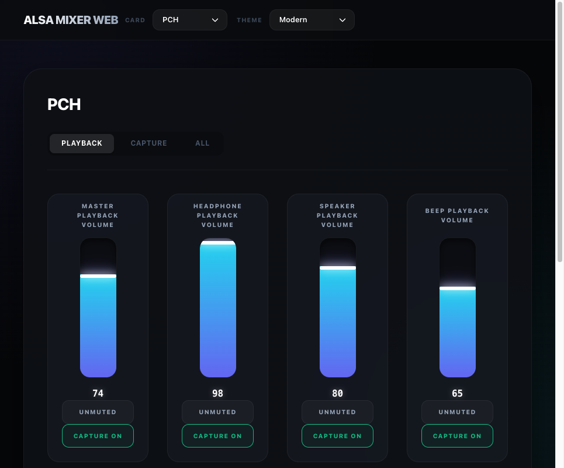 | 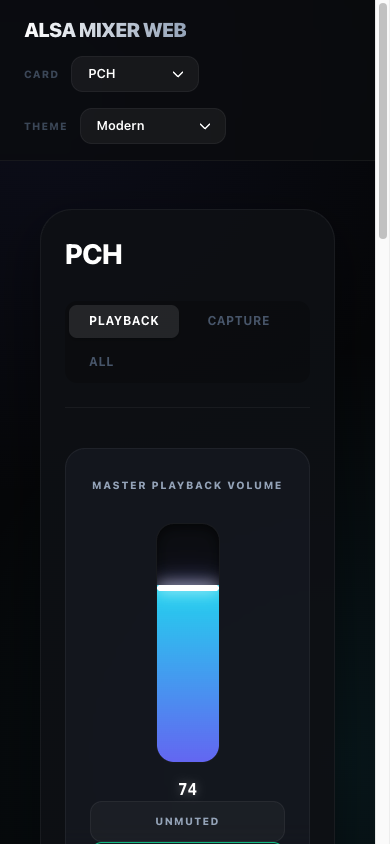 |

### Muji
Inspired by minimalist aesthetics, focused on clarity and calm.

| Desktop | Mobile |
|---------|--------|
| 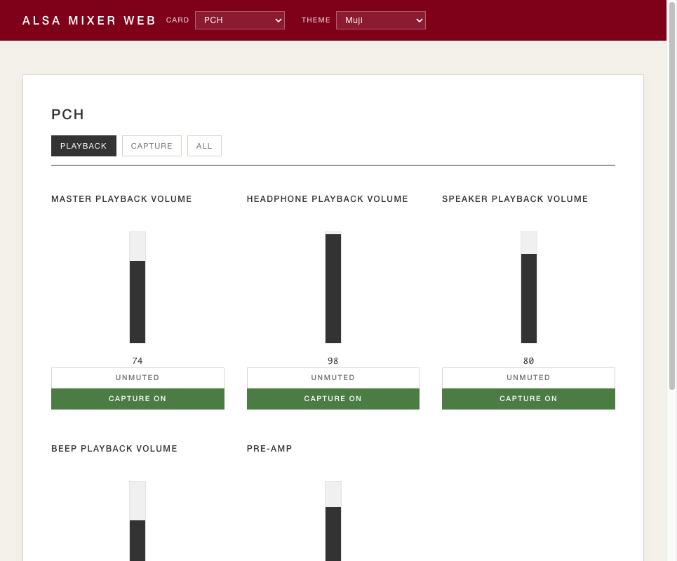 | 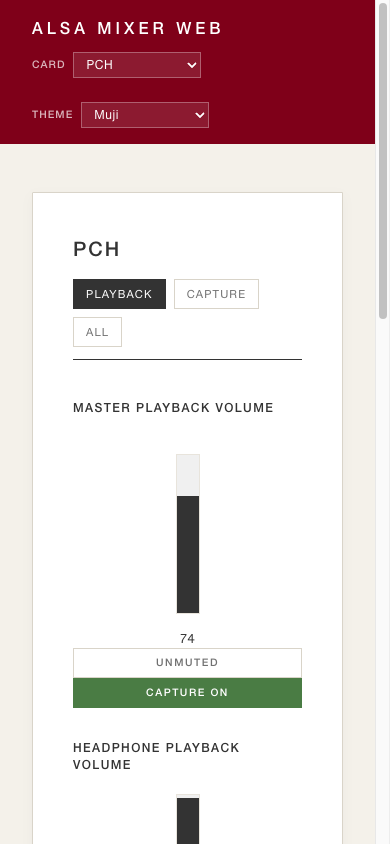 |

### Mobile
Optimized specifically for touch devices with a focus on large, tactile controls and a smooth carousel navigation.

| Desktop | Mobile |
|---------|--------|
| 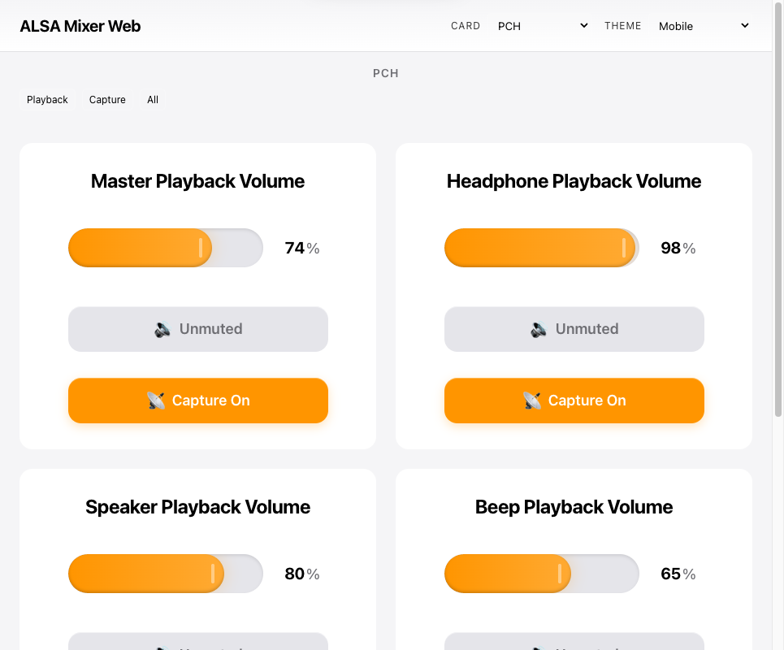 | 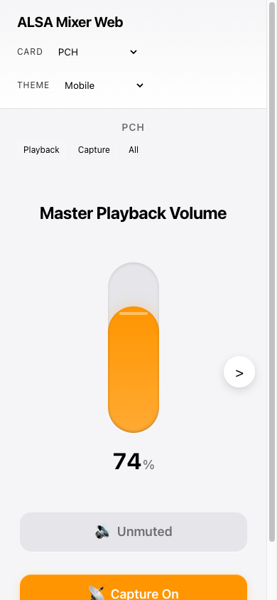 |

### Creative
A vibrant and energetic theme with high contrast and bold colors.

| Desktop | Mobile |
|---------|--------|
| 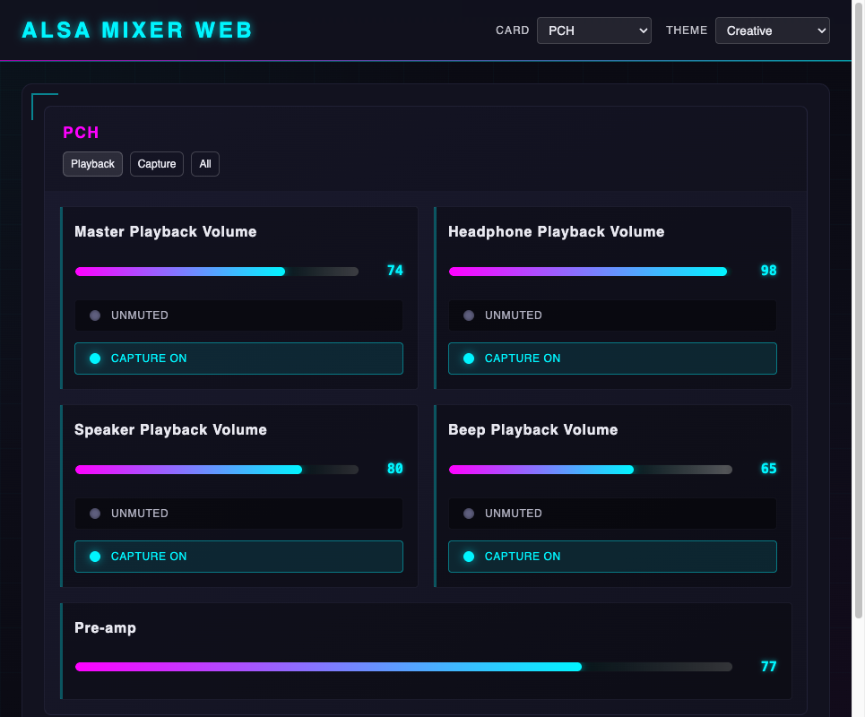 | 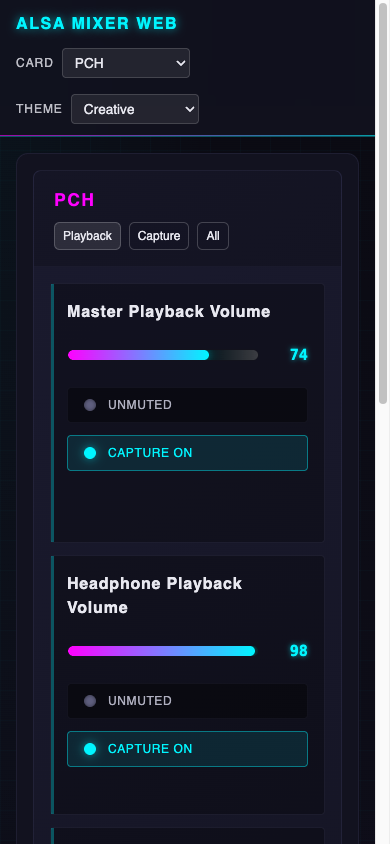 |

### Terminal
A dark, technical theme for those who love the command line vibe.

| Desktop | Mobile |
|---------|--------|
| 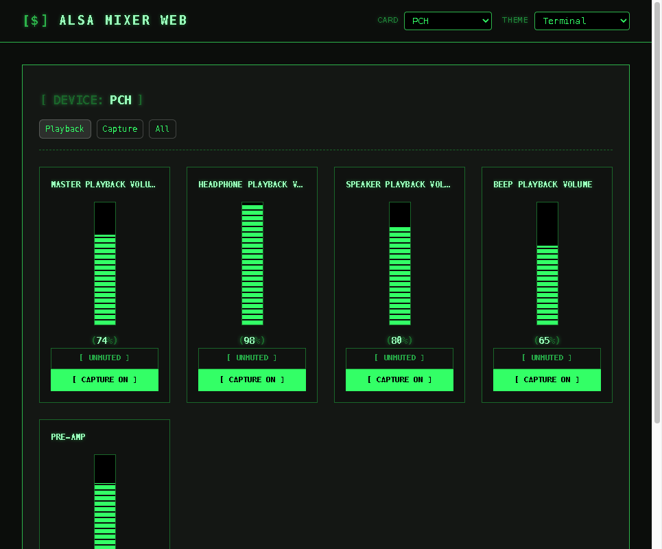 | 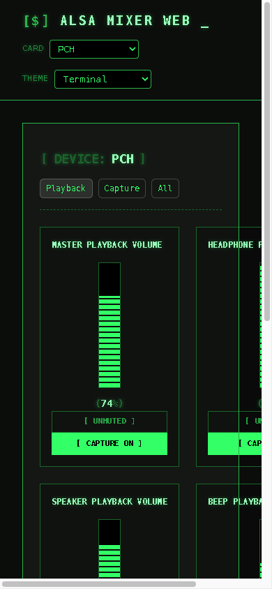 |
